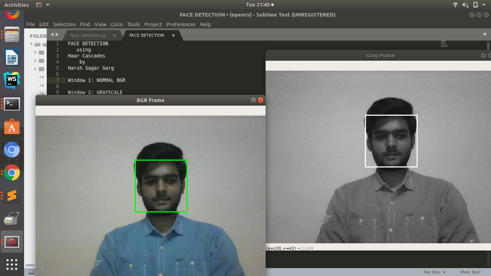
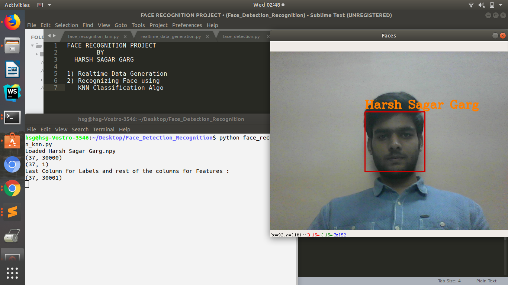

# Face-Detection-and-Recognition:mag::performing_arts: 
[](https://www.python.org/)
[](https://forthebadge.com)

[](https://github.com/harshgarg27/Face-Detection-and-Recognition)


This Project serves 3 major functionalities:
* Face Detection : By using **OpenCV** and **Haar Cascades**


* Generating Real Time Training Data by Taking Selfies from Webcam .


* RECOGNISE Face Using **KNN Classification Algorithm** .


## Getting Started

Clone the Repository, Open the terminal in the Project Folder and then
  * For Face Detection
  
  ```
  python face_detection.py
  ```
  * For Real Time Data Generation
   
   ```
   python realtime_data_generation.py
   ```
  * For Face Recognition
   
   ```
    python face_recognition_knn.py
   ```
   
### Press 'q' to stop the loop


## Project Implementation Video on Youtube
Youtube [Video Link](https://www.youtube.com/watch?v=8Gasjferv2M)


